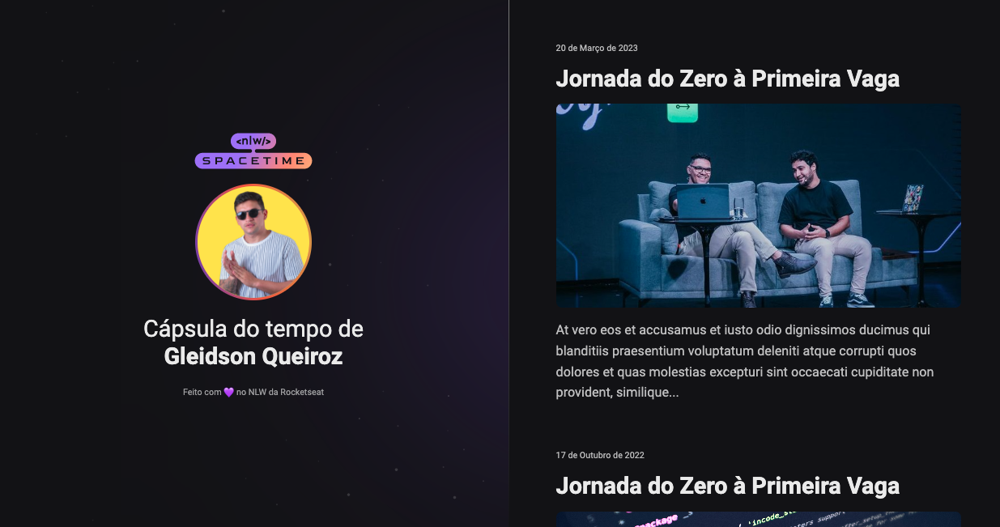

# 💻 #NLW - Spacetime

[🚀 Acesse aqui](https://queiiroz.github.io/spacetime/)

## 💻 O Evento (Trilha Explorer)

O evento em si é criar uma cápsula do tempo.

Feito apenas HTML e CSS.

## 🎨 Layout do projeto

Este é o <a href="https://www.figma.com/file/S3GjDZOeJ2sZd7JyDp5Slm/C%C3%A1psula-do-tempo-%E2%80%A2-Trilha-Explorer-(Community)?type=design&node-id=306-3&t=wtDOAkhK6RbZ8VTU-0">layout do projeto</a> no Figma.

## 🛠 Tecnologias

- HTML
- CSS
- Git
- GitHub

<table>
  <tr>
    <td>
     
    </td>
    <td>
      Feito por Gleidson Queiroz.</a> 🙋🏼‍♂️
    </td>
  </tr>
</table>
